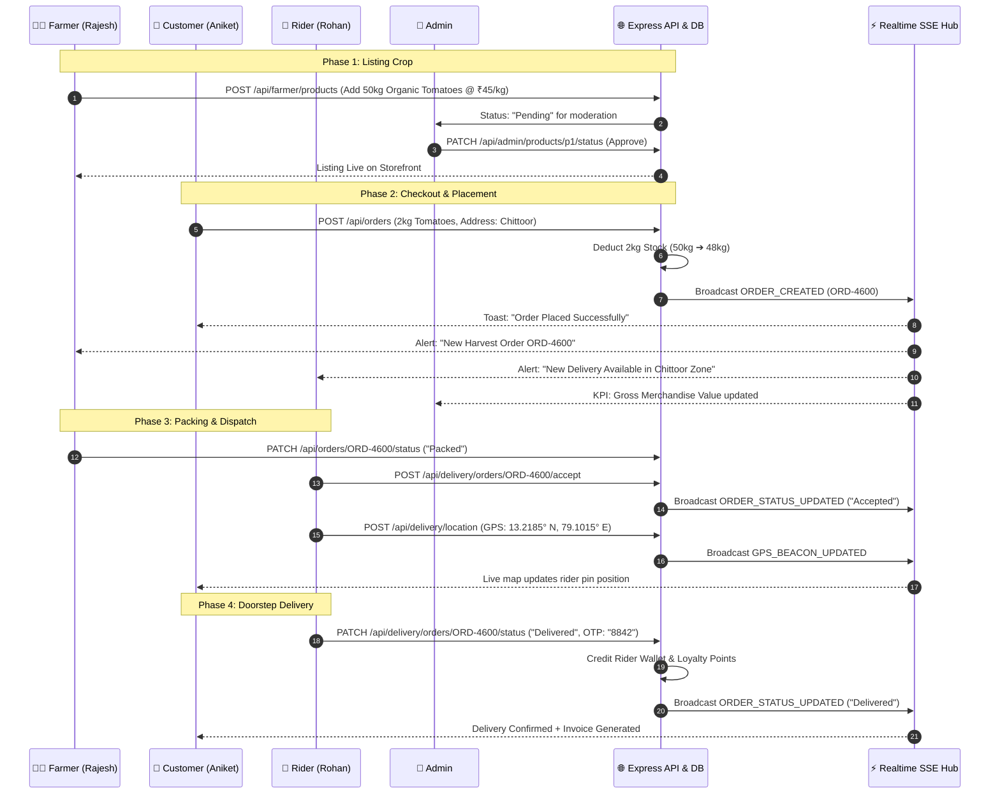

# LocalFarm Direct — Comprehensive System Block Diagram & Data Flow

This document provides a single-file, end-to-end architectural reference of **LocalFarm Direct**, explaining how every layer works with complete sample data payloads across all four roles (**Customer**, **Farmer**, **Delivery Partner**, and **Admin**).

---

## 1. High-Level Master Architecture Block Diagram

```mermaid
flowchart TB
    %% Master Layers
    subgraph CLIENT_TIER["🖥️ 1. CLIENT TIER (React 18 + TailwindCSS + Leaflet)"]
        direction TB
        subgraph STOREFRONT["Public Storefront"]
            P1["Landing Page (LandingPage.jsx)"]
            P2["Catalog & Detail (ProductsPage.jsx)"]
            P3["Public Checkout (CheckoutPage.jsx)"]
        end
        
        subgraph ROLE_DASHBOARDS["Role Dashboards (Protected)"]
            D1["🛒 Customer Portal (/customer/*)"]
            D2["🌾 Farmer Portal (/farmer/*)"]
            D3["🛵 Delivery Rider Portal (/delivery/*)"]
            D4["👑 Admin Command Center (/admin/*)"]
        end

        subgraph FRONTEND_STATE["State & Live Listeners"]
            CTX1["AuthContext (JWT Session)"]
            CTX2["MarketplaceContext (Products & Orders)"]
            CTX3["CartContext (Persistent Cart)"]
            SVC1["realtimeService.js (SSE Client)"]
        end
    end

    subgraph API_GATEWAY["⚡ 2. BACKEND API GATEWAY (Node.js Express)"]
        direction TB
        GW["Express App (app.js)"]
        SEC["Security: Helmet, CORS, RateLimiter"]
        AUTH["Auth Middleware (verifyToken & optionalAuth)"]
        
        subgraph ROUTERS["API Route Controllers"]
            R_AUTH["/api/auth (authController.js)"]
            R_ORD["/api/orders (orderController.js)"]
            R_PRD["/api/products (productController.js)"]
            R_FARM["/api/farmer (farmerController.js)"]
            R_DEL["/api/delivery (deliveryController.js)"]
            R_ADM["/api/admin (adminController.js)"]
        end

        subgraph REALTIME_ENGINE["Live Event Hub"]
            SSE_HUB["realtimeEvents.js (SSE Stream Hub)"]
        end
    end

    subgraph STORAGE_TIER["💾 3. PERSISTENCE TIER (MySQL 8.0 InnoDB)"]
        direction TB
        DB_USERS[("users & auth_token")]
        DB_PROFILES[("farmer_profiles / delivery_profiles")]
        DB_CATALOG[("products & categories & product_images")]
        DB_ORDERS[("orders & order_items & order_timeline")]
        DB_TRACKING[("delivery_tracking & GPS telemetry")]
        DB_COUPONS[("coupons & customer_loyalty")]
    end

    %% Client to API Connections
    STOREFRONT --> CTX1 & CTX2 & CTX3
    ROLE_DASHBOARDS --> CTX1 & CTX2 & CTX3
    CTX2 <--> SVC1

    CTX1 -->|HTTP POST /api/auth/login| R_AUTH
    CTX2 -->|HTTP POST /api/orders| R_ORD
    CTX2 -->|HTTP GET /api/products| R_PRD
    D2 -->|HTTP CRUD /api/farmer/*| R_FARM
    D3 -->|HTTP PATCH /api/delivery/*| R_DEL
    D4 -->|HTTP PATCH /api/admin/*| R_ADM

    SVC1 <==>|SSE Stream: /api/orders/live/stream| SSE_HUB

    %% Controller to Realtime Hub & DB
    R_ORD -->|1. Commit Transaction| DB_ORDERS
    R_ORD -->|2. Deduct Inventory| DB_CATALOG
    R_ORD -->|3. Broadcast ORDER_CREATED| SSE_HUB
    
    R_DEL -->|Update Status & GPS Telemetry| DB_TRACKING
    R_DEL -->|Broadcast GPS_BEACON & STATUS_UPDATED| SSE_HUB

    R_FARM -->|Manage Harvest & Inventory| DB_CATALOG
    R_FARM -->|Update Status to Packed| DB_ORDERS
    
    R_ADM -->|KYC Approval & Moderation| DB_PROFILES
    R_ADM -->|Platform Ledger| DB_ORDERS

    %% Push to Client
    SSE_HUB -.->|Live Push to All Roles| SVC1
```



---

## 2. End-to-End Lifecycle with Sample Data

The following diagram tracks a single crop item (**Organic Sweet Tomatoes**) through the entire system life cycle from **Farmer Harvest** to **Customer Delivery**:



---

## 3. Sample Data Payloads by Module

### 1. User Authentication (`/api/auth/login`)
```json
{
  "request": {
    "email": "aniket.sharma@gmail.com",
    "password": "password123",
    "role": "Customer"
  },
  "response": {
    "success": true,
    "user": {
      "id": "u-cust-101",
      "name": "Aniket Sharma",
      "email": "aniket.sharma@gmail.com",
      "role": "Customer",
      "phone": "+91 98765 43210",
      "avatar": "https://images.unsplash.com/photo-1534528741775-53994a69daeb?w=150"
    },
    "token": "eyJhbGciOiJIUzI1NiIsInR5cCI6IkpXVCJ9..."
  }
}
```

---

### 2. Product Catalog Listing (`/api/products`)
```json
{
  "id": "p1",
  "name": "Fresh Farm Organic Tomatoes",
  "category": "Organic Veggies",
  "price": 45.00,
  "unit": "kg",
  "stock": 48,
  "isOrganic": true,
  "harvestTag": "Harvested 4 hours ago",
  "harvestDate": "2026-10-02",
  "rating": 4.9,
  "reviewsCount": 128,
  "farmer": {
    "id": "u-farm-201",
    "farmName": "Palamaner Organic Farms",
    "location": "Palamaner, Chittoor District, AP",
    "experienceYears": 12
  },
  "images": [
    "https://images.unsplash.com/photo-1546470427-e26264be0b11?w=800"
  ]
}
```

---

### 3. Order Placement (`POST /api/orders`)
```json
{
  "request": {
    "items": [
      { "productId": "p1", "quantity": 2 }
    ],
    "addressText": "Flat 402, Green Meadows, Chittoor Road, AP",
    "customerLat": 13.2172,
    "customerLng": 79.1003,
    "paymentMethod": "UPI",
    "couponCode": "FARM10"
  },
  "response": {
    "success": true,
    "order": {
      "orderId": "ORD-4600",
      "subtotal": 90.00,
      "deliveryFee": 30.00,
      "discountAmount": 9.00,
      "tipAmount": 0.00,
      "totalAmount": 111.00,
      "otpCode": "8842",
      "status": "Pending"
    }
  }
}
```

---

### 4. Real-Time Telemetry Beacon (`POST /api/delivery/location`)
```json
{
  "request": {
    "orderId": "ORD-4600",
    "latitude": 13.2185,
    "longitude": 79.1015,
    "speed": 38.5,
    "heading": 85
  },
  "sse_broadcast_event": {
    "event": "GPS_BEACON_UPDATED",
    "data": {
      "orderId": "ORD-4600",
      "lat": 13.2185,
      "lng": 79.1015,
      "speed": 38.5,
      "heading": 85,
      "riderId": "u-del-301",
      "timestamp": "2026-10-02T03:38:20.000Z"
    }
  }
}
```

---

### 5. Order Status Update (`PATCH /api/delivery/orders/ORD-4600/status`)
```json
{
  "request": {
    "status": "Delivered",
    "otpCode": "8842",
    "proofPhotoUrl": "https://res.cloudinary.com/localfarm/proof-4600.jpg"
  },
  "sse_broadcast_event": {
    "event": "ORDER_STATUS_UPDATED",
    "data": {
      "orderId": "ORD-4600",
      "status": "Delivered",
      "proofPhotoUrl": "https://res.cloudinary.com/localfarm/proof-4600.jpg",
      "deliveryPartnerId": "u-del-301",
      "actorRole": "Delivery",
      "timestamp": "2026-10-02T03:40:15.000Z"
    }
  }
}
```

---

## 4. Test User Matrix for All 4 Roles

All seed accounts share the same password for testing and development:

```
Default Password: password123
```

| Role | Email | Responsibilities & UI Features |
| :--- | :--- | :--- |
| **👑 Admin** | `admin@localfarmdirect.in` | KYC approval, commission rates, global orders, fleet manager |
| **👨‍🌾 Farmer** | `rajesh.farmer@localfarm.in` | Crop inventory, price setting, order packaging, harvest planner |
| **🛵 Delivery** | `rohan.delivery@localfarm.in` | Order pickup queue, live GPS navigation, OTP drop-off proof |
| **🛒 Customer** | `aniket.sharma@gmail.com` | Marketplace browsing, live order map, wallet, subscription box |

---

## 5. Frontend & Backend Error Handling Architecture

```mermaid
flowchart TD
    A[HTTP Request / API Call] --> B[apiClient.js Centralized Gateway]
    B -->|Network or HTTP 4xx/5xx| C{Is Error Handled Locally?}
    
    C -->|Background / Polling| D[Return Safe Fallback: [] or null]
    C -->|User Action / Checkout| E[Attach status + data & Rethrow Error]
    
    E --> F[Context / UI Toast Notification]
    D --> G[UI Renders Empty State / Retry Button]
```

### 1. Centralized Gateway (`apiClient.js`)
All HTTP requests flow through a single gateway that normalizes error objects and handles non-JSON / 204 edge cases:

```javascript
// apiClient.js
try {
  const response = await fetch(`${API_BASE_URL}${endpoint}`, config);

  if (!response.ok) {
    const errorData = await response.json().catch(() => ({}));
    const error = new Error(errorData.message || `API Request failed with status ${response.status}`);
    error.status = response.status;
    error.data = errorData;
    throw error;
  }
  return await response.json();
} catch (err) {
  console.error(`[API Request Error] ${options.method || 'GET'} ${endpoint}:`, err);
  throw err;
}
```

### 2. Service-Layer Error Rethrowing Pattern
Critical mutation methods rethrow to allow the calling UI or Context to extract precise error messages:

```javascript
// orderService.js: Rethrows error up so caller can handle specific validation message
async placeOrder(orderPayload) {
  const res = await apiClient('/orders', {
    method: 'POST',
    body: orderPayload,
  });
  return res?.order || res;
}
```

### 3. Context & UI Toast Capture Pattern
User-facing operations catch errors and trigger global toast notifications:

```javascript
// AuthContext.jsx: Catches error and triggers global toast notification
try {
  const loggedUser = await authService.login(email, password, role);
  showToast('Welcome back!', `Logged in successfully as ${role}`);
} catch (e) {
  showToast('Login Failed', e.message || 'Unable to sign in.', 'error');
  throw e;
}
```

### 4. Background & Polling Non-Blocking Fallback Pattern
Background fetches fall back to empty structures, preventing the UI from crashing:

```javascript
// orderService.js: Gracefully falls back to empty array if network drops
try {
  const res = await apiClient(endpoint);
  return res?.orders || [];
} catch (err) {
  console.warn('[orderService] Failed to fetch orders:', err);
  return []; // Safe fallback
}
```
