# LocalFarm Direct — Master Full-Stack Architecture & API Specification (v4.0)

> **Architect Role:** Senior Full-Stack & Backend Systems Architect (10+ Years Experience)  
> **Backend Stack:** Node.js (v18+) • Express.js • MySQL (v8.0+ InnoDB) • Cloudinary CDN • JWT + RBAC  
> **Frontend Stack:** React 18+ (Vite) • TailwindCSS • Context API • i18next (EN, HI, TE, MR)  
> **Backend Root:** `c:\Green-market\LocalFarm\backend`  
> **Frontend Root:** `c:\Green-market\LocalFarm\frontend`

---

## 1. System Architecture Overview

```
                               ┌────────────────────────────────────────────────────────┐
                               │                 REACT 18+ SPA (Vite)                   │
                               │   Customer • Farmer • Delivery Partner • SuperAdmin    │
                               │   TailwindCSS • Lucide Icons • i18n (EN, HI, TE, MR)   │
                               └───────────────────────────┬────────────────────────────┘
                                                           │ HTTPS / JSON / Multipart
                                                           ▼
                               ┌────────────────────────────────────────────────────────┐
                               │                EXPRESS.JS API GATEWAY                  │
                               │   • CORS (Whitelist)           • Helmet Security       │
                               │   • Express Rate Limiting      • Morgan HTTP Logger    │
                               │   • Global Error Handling      • Centralized DTO Valid │
                               └───────────┬───────────────┬───────────────┬────────────┘
                                           │               │               │
                     ┌─────────────────────┘               │               └──────────────────────┐
                     ▼                                     ▼                                      ▼
       ┌───────────────────────────┐         ┌───────────────────────────┐          ┌───────────────────────────┐
       │     JWT & RBAC ENGINE     │         │  CLOUDINARY MEDIA STREAM  │          │  MYSQL RELATIONAL ENGINE  │
       │  • Customer (Loyalty Tiers│         │  • Multi-Image Crop Upload│          │  • InnoDB Connection Pool │
       │  • Farmer (KYC / Payouts) │         │  • Farmer Certs & FSSAI   │          │  • ACID Multi-Table Trans │
       │  • Delivery (Shifts / GPS)│         │  • Driving License / RC   │          │  • Spatial Coordinates    │
       │  • Admin (Audit & Config) │         │  • Proof of Delivery CDN  │          │  • Foreign Key Constraints│
       └───────────────────────────┘         └───────────────────────────┘          └───────────────────────────┘
```

---

## 2. Visual Entity Relationship Diagram (ERD)

```mermaid
erDiagram
    USERS ||--o| FARMER_PROFILES : "1:1 has profile"
    USERS ||--o| DELIVERY_PROFILES : "1:1 has profile"
    USERS ||--o| CUSTOMER_LOYALTY : "1:1 has loyalty"
    USERS ||--o{ CUSTOMER_ADDRESSES : "1:N has addresses"
    USERS ||--o{ CUSTOMER_WISHLISTS : "1:N saves wishlists"
    USERS ||--o{ NOTIFICATIONS : "1:N receives notifications"
    USERS ||--o{ KYC_DOCUMENTS : "1:N submits documents"
    USERS ||--o{ REVIEWS : "1:N writes reviews"
    
    USERS ||--o{ ORDERS : "1:N places (Customer)"
    USERS ||--o{ ORDERS : "1:N delivers (Delivery Partner)"
    
    CATEGORIES ||--o{ PRODUCTS : "1:N contains products"
    USERS ||--o{ PRODUCTS : "1:N listed by (Farmer)"
    PRODUCTS ||--o{ PRODUCT_IMAGES : "1:N has images"
    PRODUCTS ||--o{ REVIEWS : "1:N receives reviews"
    PRODUCTS ||--o{ CUSTOMER_WISHLISTS : "1:N bookmarked in"
    PRODUCTS ||--o{ CUSTOMER_SUBSCRIPTIONS : "1:N subscribed in"
    PRODUCTS ||--o{ INVENTORY_BATCHES : "1:N tracked in batches"
    
    ORDERS ||--o{ ORDER_ITEMS : "1:N contains items"
    PRODUCTS ||--o{ ORDER_ITEMS : "1:N ordered via"
    USERS ||--o{ ORDER_ITEMS : "1:N fulfilled by (Farmer)"
    
    ORDERS ||--o{ ORDER_TIMELINE : "1:N has status events"
    ORDERS ||--o| DELIVERY_TRACKING : "1:1 live GPS telemetry"
    
    DELIVERY_HUBS ||--o{ DELIVERY_SHIFTS : "1:N hosts shifts"
    USERS ||--o{ DELIVERY_SHIFTS : "1:N assigned to (Rider)"
    DELIVERY_HUBS ||--o{ DELIVERY_PROFILES : "1:N base hub"
    
    USERS ||--o{ FARMER_HARVEST_PLANS : "1:N plans harvests"
    USERS ||--o{ INVENTORY_BATCHES : "1:N logs batch spoilage"
    USERS ||--o{ FARMER_PAYOUTS : "1:N receives payouts"
    
    COUPONS ||--o{ COUPON_REDEMPTIONS : "1:N redeemed in"
    ORDERS ||--o{ COUPON_REDEMPTIONS : "1:N applies coupon"
    USERS ||--o{ AUDIT_LOGS : "1:N executed by (Admin)"
```



---

## 3. Frontend Mock-to-Real API Replacement Matrix

Here is the exact pin-to-pin mapping of every file in the frontend currently using mock or in-memory state and the corresponding backend API endpoint that replaces it:

### 3.1 Public Marketplace & Authentication
| Frontend File | Mock / Dummy Data Source | Replacement Backend API Endpoint | HTTP Method | React Hook / Service Call |
| :--- | :--- | :--- | :--- | :--- |
| `frontend/src/components/Auth/SlidingAuthContainer.jsx` | `authService.login()`, `authService.register()` (mock delay) | `/api/auth/login`<br>`/api/auth/register` | `POST` | `authService.login(email, password, role)`<br>`authService.register(name, email, password, role)` |
| `frontend/src/pages/LandingPage.jsx`<br>`frontend/src/pages/ProductsPage.jsx` | `PRODUCTS` in `mockData.js` | `/api/products` | `GET` | `productService.fetchProducts(filters)` |
| `frontend/src/pages/ProductDetailPage.jsx`<br>`frontend/src/pages/Customer/ProduceDetailModal.jsx` | `PRODUCTS.find()` in `mockData.js` | `/api/products/:id` | `GET` | `productService.fetchProductById(id)` |
| `frontend/src/pages/FarmProfilePage.jsx` | `FARMERS.find()` in `mockData.js` | `/api/farms/:farmerId` | `GET` | `farmerService.fetchFarmProfile(farmerId)` |
| `frontend/src/pages/CheckoutPage.jsx`<br>`frontend/src/pages/Customer/CustomerCartCheckout.jsx` | Local cart state + `orderService.placeOrder()` mock | `/api/orders` | `POST` | `orderService.placeOrder(orderPayload)` |
| `frontend/src/components/MemberRank.jsx`<br>`frontend/src/pages/Customer/CustomerHome.jsx` | Static order count (e.g. 35) | `/api/customers/tier` | `GET` | `customerService.fetchLoyaltyTier()` |
| `frontend/src/pages/Customer/DiscountForm.jsx` | Static discount coupon codes | `/api/coupons/validate` | `POST` | `orderService.validateCoupon(code, subtotal)` |

---

### 3.2 Customer Dashboard
| Frontend File | Mock / Dummy Data Source | Replacement Backend API Endpoint | HTTP Method | React Hook / Service Call |
| :--- | :--- | :--- | :--- | :--- |
| `frontend/src/pages/Customer/CustomerHome.jsx` | `PRODUCTS`, `FARMERS`, mock favorites | `/api/products?featured=true`<br>`/api/customers/favorites` | `GET` | `productService.fetchFeatured()`<br>`customerService.fetchFavorites()` |
| `frontend/src/pages/Customer/CustomerOrders.jsx` | `ORDERS` array in `mockData.js` | `/api/orders/my-orders`<br>`/api/orders/:id/track` | `GET` | `orderService.fetchOrders('Customer')`<br>`orderService.trackOrder(orderId)` |
| `frontend/src/pages/Customer/CustomerSubscriptions.jsx` | Hardcoded `subscriptions` state | `/api/subscriptions`<br>`/api/subscriptions/:id` | `GET`<br>`PATCH` | `customerService.fetchSubscriptions()`<br>`customerService.updateSubscription(id, changes)` |
| `frontend/src/pages/Customer/CustomerWishlist.jsx` | Local storage wishlist state | `/api/customers/wishlist` | `GET`<br>`POST`<br>`DELETE` | `customerService.getWishlist()`<br>`customerService.toggleWishlist(productId)` |
| `frontend/src/pages/Customer/CustomerProfileSettings.jsx` | Static profile state & addresses | `/api/customers/profile`<br>`/api/customers/addresses` | `GET`<br>`PUT`<br>`POST` | `customerService.getProfile()`<br>`customerService.updateProfile(data)` |

---

### 3.3 Farmer Dashboard
| Frontend File | Mock / Dummy Data Source | Replacement Backend API Endpoint | HTTP Method | React Hook / Service Call |
| :--- | :--- | :--- | :--- | :--- |
| `frontend/src/pages/Farmer/FarmerDashboardView.jsx` | Hardcoded sales figures & sparklines | `/api/farmer/overview` | `GET` | `farmerService.fetchOverviewKPIs()` |
| `frontend/src/pages/Farmer/FarmerProducts.jsx` | In-memory `products` state | `/api/farmer/products`<br>`/api/media/upload` | `GET`<br>`POST`<br>`PATCH`<br>`DELETE` | `farmerService.fetchMyProducts()`<br>`mediaService.uploadImages(files, 'crops')`<br>`farmerService.createProduct(data)` |
| `frontend/src/pages/Farmer/FarmerOrders.jsx` | `ORDERS` filtered by farmer | `/api/farmer/orders`<br>`/api/farmer/orders/:id/status` | `GET`<br>`PATCH` | `farmerService.fetchOrders()`<br>`farmerService.updateOrderStatus(orderId, status, note)` |
| `frontend/src/pages/Farmer/FarmerHarvestPlanner.jsx` | `defaultSeasons` state | `/api/farmer/harvest-plans`<br>`/api/farmer/harvest-plans/:id/broadcast` | `GET`<br>`POST`<br>`PUT` | `farmerService.fetchHarvestPlans()`<br>`farmerService.createHarvestPlan(plan)`<br>`farmerService.broadcastHarvestAlert(id, msg)` |
| `frontend/src/pages/Farmer/FarmerInventory.jsx` | Product stock delta in frontend state | `/api/farmer/inventory/batches`<br>`/api/farmer/products/:id/stock` | `GET`<br>`POST`<br>`PATCH` | `farmerService.fetchBatches()`<br>`farmerService.logBatchSpoilage(batchData)`<br>`farmerService.quickRestock(id, delta)` |
| `frontend/src/pages/Farmer/FarmerSales.jsx` | Hardcoded monthly revenue array | `/api/farmer/sales`<br>`/api/farmer/payouts` | `GET`<br>`POST` | `farmerService.fetchSalesAnalytics()`<br>`farmerService.requestPayout(amount, bankDetails)` |
| `frontend/src/pages/Farmer/FarmerSettings.jsx` | Static farmer bio & KYC state | `/api/farmer/profile`<br>`/api/kyc/upload` | `GET`<br>`PUT` | `farmerService.getProfile()`<br>`farmerService.updateProfile(profileData)` |

---

### 3.4 Delivery Partner Portal
| Frontend File | Mock / Dummy Data Source | Replacement Backend API Endpoint | HTTP Method | React Hook / Service Call |
| :--- | :--- | :--- | :--- | :--- |
| `frontend/src/pages/Delivery/DeliveryDashboardView.jsx` | `INITIAL_DELIVERY_ORDERS` | `/api/delivery/overview`<br>`/api/delivery/duty` | `GET`<br>`PATCH` | `deliveryService.fetchOverview()`<br>`deliveryService.toggleDuty(isOnline, coords)` |
| `frontend/src/pages/Delivery/MyDeliveries.jsx` | Mock delivery list | `/api/delivery/orders`<br>`/api/delivery/orders/:id/accept` | `GET`<br>`POST` | `deliveryService.fetchOrders(tab)`<br>`deliveryService.acceptTask(orderId, accept)` |
| `frontend/src/pages/Delivery/DeliveryTracking.jsx` | Simulated GPS coordinates | `/api/delivery/location` | `POST` | `deliveryService.sendLocationBeacon(lat, lng, orderId)` |
| `frontend/src/pages/Delivery/OrderStatusView.jsx` | Mock status advance buttons | `/api/delivery/orders/:id/status`<br>`/api/media/upload` | `PATCH`<br>`POST` | `mediaService.uploadImages(file, 'proofs')`<br>`deliveryService.updateOrderStatus(orderId, status, proofUrl, otp)` |
| `frontend/src/pages/Delivery/DeliveryShiftSchedule.jsx` | Hardcoded `HUBS`, `SHIFT_PRESETS` | `/api/delivery/shifts`<br>`/api/delivery/hubs` | `GET`<br>`POST` | `deliveryService.fetchHubs()`<br>`deliveryService.fetchShifts()`<br>`deliveryService.bookShift(data)` |
| `frontend/src/pages/Delivery/DeliveryEarnings.jsx` | Static earnings figures | `/api/delivery/earnings` | `GET` | `deliveryService.fetchEarnings(period)` |
| `frontend/src/pages/Delivery/DeliveryProfileSettings.jsx` | `INITIAL_DELIVERY_PROFILE` | `/api/delivery/profile` | `GET`<br>`PUT` | `deliveryService.getProfile()`<br>`deliveryService.updateProfile(data)` |

---

### 3.5 Admin Superuser Suite
| Frontend File | Mock / Dummy Data Source | Replacement Backend API Endpoint | HTTP Method | React Hook / Service Call |
| :--- | :--- | :--- | :--- | :--- |
| `frontend/src/pages/Admin/AdminDashboardView.jsx` | `SPARKLINE_DATA`, `STATS` in `mockData.js` | `/api/admin/metrics` | `GET` | `adminService.fetchPlatformMetrics()` |
| `frontend/src/pages/Admin/ProductManagement.jsx` | `PRODUCTS` in `mockData.js` | `/api/admin/products`<br>`/api/admin/products/:id/moderate` | `GET`<br>`PATCH` | `adminService.fetchProducts()`<br>`adminService.moderateProduct(id, status, remark)` |
| `frontend/src/pages/Admin/OrderManagement.jsx` | `ORDERS` in `mockData.js` | `/api/admin/orders`<br>`/api/admin/orders/:id/dispatch` | `GET`<br>`PATCH` | `adminService.fetchOrders()`<br>`adminService.overrideDispatch(orderId, riderId)` |
| `frontend/src/pages/Admin/FarmerManagement.jsx` | `FARMERS` in `mockData.js` | `/api/admin/farmers`<br>`/api/admin/farmers/:id/verify` | `GET`<br>`PATCH` | `adminService.fetchFarmers()`<br>`adminService.verifyFarmer(id, approvalStatus, accountStatus)` |
| `frontend/src/pages/Admin/CustomerManagement.jsx` | `CUSTOMERS` in `mockData.js` | `/api/admin/customers`<br>`/api/admin/customers/:id/status` | `GET`<br>`PATCH` | `adminService.fetchCustomers()`<br>`adminService.setCustomerStatus(id, status)` |
| `frontend/src/pages/Admin/DeliveryManagement.jsx` | `MOCK_USERS.delivery` in `AdminSettings.jsx` | `/api/admin/delivery-partners`<br>`/api/admin/delivery-partners/:id/verify` | `GET`<br>`PATCH` | `adminService.fetchDeliveryFleet()`<br>`adminService.verifyRider(id, status)` |
| `frontend/src/pages/Admin/ReportsAnalytics.jsx` | `REPORTS_DATA` in `mockData.js` | `/api/admin/reports` | `GET` | `adminService.fetchReports(type, from, to, format)` |
| `frontend/src/pages/Admin/AdminSettings.jsx` | `INITIAL_SETTINGS` in `mockData.js` | `/api/admin/settings` | `GET`<br>`PUT` | `adminService.fetchSettings()`<br>`adminService.updateSettings(settings)` |
| `frontend/src/pages/Admin/tabs/CommissionTab.jsx` | Commission slider state | `/api/admin/commission-rules` | `GET`<br>`PUT` | `adminService.fetchCommissionRules()`<br>`adminService.saveCommissionRules(rules)` |
| `frontend/src/pages/Admin/tabs/KycQueueTab.jsx` | `MOCK_KYC` array | `/api/admin/kyc-queue`<br>`/api/admin/kyc-queue/:id/decision` | `GET`<br>`PATCH` | `adminService.fetchKycQueue()`<br>`adminService.decideKyc(id, status, notes)` |
| `frontend/src/pages/Admin/tabs/AuditLogTab.jsx` | `MOCK_AUDIT_LOG` array | `/api/admin/audit-logs` | `GET` | `adminService.fetchAuditLogs(page, limit)` |

---

## 4. Production MySQL 8.0 DDL Schema (Complete 22 Connected Tables)

```sql
-- ==============================================================================
-- LOCALFARM DIRECT — MASTER RELATIONAL DDL (MySQL 8.0+ InnoDB Engine)
-- ==============================================================================

CREATE DATABASE IF NOT EXISTS localfarm_db CHARACTER SET utf8mb4 COLLATE utf8mb4_unicode_ci;
USE localfarm_db;

-- 1. Users Table (Core Identity & Authentication)
CREATE TABLE users (
    id VARCHAR(36) PRIMARY KEY,
    name VARCHAR(100) NOT NULL,
    email VARCHAR(150) NOT NULL UNIQUE,
    password_hash VARCHAR(255) NOT NULL,
    phone VARCHAR(20),
    role ENUM('Customer', 'Farmer', 'Delivery', 'Admin') NOT NULL DEFAULT 'Customer',
    avatar_url VARCHAR(500),
    is_active BOOLEAN DEFAULT TRUE,
    created_at TIMESTAMP DEFAULT CURRENT_TIMESTAMP,
    updated_at TIMESTAMP DEFAULT CURRENT_TIMESTAMP ON UPDATE CURRENT_TIMESTAMP,
    INDEX idx_user_role (role),
    INDEX idx_user_email (email)
) ENGINE=InnoDB;

-- 2. Delivery Hubs Table (Distribution Centers)
CREATE TABLE delivery_hubs (
    id VARCHAR(50) PRIMARY KEY, -- e.g. 'pune_central', 'chittoor_link'
    name VARCHAR(100) NOT NULL,
    zone VARCHAR(100) NOT NULL,
    address VARCHAR(255),
    latitude DECIMAL(10, 8),
    longitude DECIMAL(11, 8),
    created_at TIMESTAMP DEFAULT CURRENT_TIMESTAMP
) ENGINE=InnoDB;

-- 3. Farmer Profiles (1:1 with users WHERE role = 'Farmer')
CREATE TABLE farmer_profiles (
    user_id VARCHAR(36) PRIMARY KEY,
    farm_name VARCHAR(150) NOT NULL,
    location_address VARCHAR(255) NOT NULL,
    district VARCHAR(100),
    state VARCHAR(100),
    latitude DECIMAL(10, 8),
    longitude DECIMAL(11, 8),
    experience_years INT DEFAULT 0,
    specialty VARCHAR(150),
    organic_certified BOOLEAN DEFAULT FALSE,
    certificate_url VARCHAR(500),
    rating DECIMAL(3, 2) DEFAULT 5.00,
    total_earnings DECIMAL(12, 2) DEFAULT 0.00,
    approval_status ENUM('Pending', 'Approved', 'Rejected') DEFAULT 'Pending',
    account_status ENUM('Active', 'Suspended') DEFAULT 'Active',
    badge VARCHAR(50) DEFAULT 'New Farmer',
    created_at TIMESTAMP DEFAULT CURRENT_TIMESTAMP,
    updated_at TIMESTAMP DEFAULT CURRENT_TIMESTAMP ON UPDATE CURRENT_TIMESTAMP,
    FOREIGN KEY (user_id) REFERENCES users(id) ON DELETE CASCADE
) ENGINE=InnoDB;

-- 4. Delivery Partner Profiles (1:1 with users WHERE role = 'Delivery')
CREATE TABLE delivery_profiles (
    user_id VARCHAR(36) PRIMARY KEY,
    hub_id VARCHAR(50) NULL,
    vehicle_type VARCHAR(100) NOT NULL,
    vehicle_number VARCHAR(50) NOT NULL,
    license_number VARCHAR(100) NOT NULL,
    license_doc_url VARCHAR(500),
    is_online BOOLEAN DEFAULT FALSE,
    current_lat DECIMAL(10, 8),
    current_lng DECIMAL(11, 8),
    rating DECIMAL(3, 2) DEFAULT 5.00,
    total_deliveries INT DEFAULT 0,
    wallet_balance DECIMAL(10, 2) DEFAULT 0.00,
    approval_status ENUM('Pending', 'Approved', 'Rejected') DEFAULT 'Approved',
    created_at TIMESTAMP DEFAULT CURRENT_TIMESTAMP,
    updated_at TIMESTAMP DEFAULT CURRENT_TIMESTAMP ON UPDATE CURRENT_TIMESTAMP,
    FOREIGN KEY (user_id) REFERENCES users(id) ON DELETE CASCADE,
    FOREIGN KEY (hub_id) REFERENCES delivery_hubs(id) ON DELETE SET NULL
) ENGINE=InnoDB;

-- 5. Customer Addresses (1:N with users)
CREATE TABLE customer_addresses (
    id VARCHAR(36) PRIMARY KEY,
    customer_id VARCHAR(36) NOT NULL,
    label VARCHAR(50) DEFAULT 'Home',
    address_line VARCHAR(255) NOT NULL,
    landmark VARCHAR(150),
    city VARCHAR(100) NOT NULL,
    state VARCHAR(100) NOT NULL,
    pincode VARCHAR(10) NOT NULL,
    latitude DECIMAL(10, 8),
    longitude DECIMAL(11, 8),
    is_default BOOLEAN DEFAULT FALSE,
    created_at TIMESTAMP DEFAULT CURRENT_TIMESTAMP,
    FOREIGN KEY (customer_id) REFERENCES users(id) ON DELETE CASCADE,
    INDEX idx_customer_addr (customer_id)
) ENGINE=InnoDB;

-- 6. Customer Loyalty & Member Ranks (1:1 with users)
CREATE TABLE customer_loyalty (
    customer_id VARCHAR(36) PRIMARY KEY,
    order_count INT DEFAULT 0,
    total_spent DECIMAL(12, 2) DEFAULT 0.00,
    tier ENUM('Bronze', 'Silver', 'Gold') DEFAULT 'Bronze',
    created_at TIMESTAMP DEFAULT CURRENT_TIMESTAMP,
    updated_at TIMESTAMP DEFAULT CURRENT_TIMESTAMP ON UPDATE CURRENT_TIMESTAMP,
    FOREIGN KEY (customer_id) REFERENCES users(id) ON DELETE CASCADE
) ENGINE=InnoDB;

-- 7. Categories Table
CREATE TABLE categories (
    id VARCHAR(50) PRIMARY KEY, -- 'Organic Veggies', 'Seasonal Picks', 'Dairy & Eggs', 'Bulk Farm Boxes', 'Grocery & Oils'
    name VARCHAR(100) NOT NULL,
    icon VARCHAR(50) DEFAULT 'Sparkles',
    description VARCHAR(255),
    created_at TIMESTAMP DEFAULT CURRENT_TIMESTAMP
) ENGINE=InnoDB;

-- 8. Products Table (Crop Listings)
CREATE TABLE products (
    id VARCHAR(36) PRIMARY KEY,
    farmer_id VARCHAR(36) NOT NULL,
    category_id VARCHAR(50) NOT NULL,
    name VARCHAR(150) NOT NULL,
    description TEXT,
    price DECIMAL(10, 2) NOT NULL,
    unit VARCHAR(30) NOT NULL DEFAULT 'kg',
    stock INT NOT NULL DEFAULT 0,
    is_organic BOOLEAN DEFAULT TRUE,
    harvest_tag VARCHAR(100) DEFAULT 'Harvested Fresh Today',
    harvest_date VARCHAR(100) NULL,
    rating DECIMAL(3, 2) DEFAULT 5.00,
    reviews_count INT DEFAULT 0,
    flash_discount DECIMAL(5, 2) DEFAULT 0.00,
    is_unavailable BOOLEAN DEFAULT FALSE,
    status ENUM('Approved', 'Pending', 'Rejected', 'Inactive') DEFAULT 'Approved',
    created_at TIMESTAMP DEFAULT CURRENT_TIMESTAMP,
    updated_at TIMESTAMP DEFAULT CURRENT_TIMESTAMP ON UPDATE CURRENT_TIMESTAMP,
    FOREIGN KEY (farmer_id) REFERENCES users(id) ON DELETE CASCADE,
    FOREIGN KEY (category_id) REFERENCES categories(id) ON DELETE RESTRICT,
    INDEX idx_product_category (category_id),
    INDEX idx_product_farmer (farmer_id),
    INDEX idx_product_status (status)
) ENGINE=InnoDB;

-- 9. Product Images (Cloudinary Multi-Image Stream)
CREATE TABLE product_images (
    id VARCHAR(36) PRIMARY KEY,
    product_id VARCHAR(36) NOT NULL,
    image_url VARCHAR(500) NOT NULL,
    cloudinary_public_id VARCHAR(200),
    is_primary BOOLEAN DEFAULT FALSE,
    display_order INT DEFAULT 0,
    created_at TIMESTAMP DEFAULT CURRENT_TIMESTAMP,
    FOREIGN KEY (product_id) REFERENCES products(id) ON DELETE CASCADE,
    INDEX idx_prod_img (product_id)
) ENGINE=InnoDB;

-- 10. Orders Table
CREATE TABLE orders (
    id VARCHAR(50) PRIMARY KEY, -- e.g. 'ORD-8821'
    customer_id VARCHAR(36) NOT NULL,
    delivery_partner_id VARCHAR(36) NULL,
    address_text TEXT NOT NULL,
    customer_lat DECIMAL(10, 8),
    customer_lng DECIMAL(11, 8),
    status ENUM('Pending', 'Approved', 'Packed', 'Assigned', 'Accepted', 'Picked Up', 'Out for Delivery', 'Delivered', 'Cancelled', 'Failed') DEFAULT 'Pending',
    subtotal DECIMAL(10, 2) NOT NULL,
    delivery_fee DECIMAL(10, 2) DEFAULT 30.00,
    discount_amount DECIMAL(10, 2) DEFAULT 0.00,
    tip_amount DECIMAL(10, 2) DEFAULT 0.00,
    total_amount DECIMAL(10, 2) NOT NULL,
    payment_method VARCHAR(50) NOT NULL,
    payment_status ENUM('Pending', 'Paid', 'Refunded', 'Failed') DEFAULT 'Pending',
    eta VARCHAR(50) DEFAULT '30-45 mins',
    failure_reason TEXT NULL,
    proof_photo_url VARCHAR(500) NULL,
    otp_code VARCHAR(6) NULL,
    created_at TIMESTAMP DEFAULT CURRENT_TIMESTAMP,
    updated_at TIMESTAMP DEFAULT CURRENT_TIMESTAMP ON UPDATE CURRENT_TIMESTAMP,
    FOREIGN KEY (customer_id) REFERENCES users(id) ON DELETE CASCADE,
    FOREIGN KEY (delivery_partner_id) REFERENCES users(id) ON DELETE SET NULL,
    INDEX idx_order_status (status),
    INDEX idx_order_customer (customer_id),
    INDEX idx_order_rider (delivery_partner_id)
) ENGINE=InnoDB;

-- 11. Order Line Items Table
CREATE TABLE order_items (
    id VARCHAR(36) PRIMARY KEY,
    order_id VARCHAR(50) NOT NULL,
    product_id VARCHAR(36) NOT NULL,
    farmer_id VARCHAR(36) NOT NULL,
    product_name VARCHAR(150) NOT NULL,
    quantity DECIMAL(8, 2) NOT NULL,
    unit VARCHAR(30) NOT NULL,
    unit_price DECIMAL(10, 2) NOT NULL,
    total_price DECIMAL(10, 2) NOT NULL,
    created_at TIMESTAMP DEFAULT CURRENT_TIMESTAMP,
    FOREIGN KEY (order_id) REFERENCES orders(id) ON DELETE CASCADE,
    FOREIGN KEY (product_id) REFERENCES products(id) ON DELETE RESTRICT,
    FOREIGN KEY (farmer_id) REFERENCES users(id) ON DELETE RESTRICT,
    INDEX idx_item_order (order_id),
    INDEX idx_item_farmer (farmer_id)
) ENGINE=InnoDB;

-- 12. Order Timeline History
CREATE TABLE order_timeline (
    id VARCHAR(36) PRIMARY KEY,
    order_id VARCHAR(50) NOT NULL,
    title VARCHAR(100) NOT NULL,
    description TEXT,
    actor_id VARCHAR(36) NULL,
    actor_role ENUM('Customer', 'Farmer', 'Delivery', 'Admin', 'System') DEFAULT 'System',
    created_at TIMESTAMP DEFAULT CURRENT_TIMESTAMP,
    FOREIGN KEY (order_id) REFERENCES orders(id) ON DELETE CASCADE,
    INDEX idx_timeline_order (order_id)
) ENGINE=InnoDB;

-- 13. Real-Time Delivery Tracking Beacon
CREATE TABLE delivery_tracking (
    id VARCHAR(36) PRIMARY KEY,
    order_id VARCHAR(50) NOT NULL UNIQUE,
    delivery_partner_id VARCHAR(36) NOT NULL,
    current_lat DECIMAL(10, 8) NOT NULL,
    current_lng DECIMAL(11, 8) NOT NULL,
    speed_kmh DECIMAL(5, 2) DEFAULT 0.00,
    heading_deg DECIMAL(5, 2) DEFAULT 0.00,
    last_beacon_at TIMESTAMP DEFAULT CURRENT_TIMESTAMP ON UPDATE CURRENT_TIMESTAMP,
    FOREIGN KEY (order_id) REFERENCES orders(id) ON DELETE CASCADE,
    FOREIGN KEY (delivery_partner_id) REFERENCES users(id) ON DELETE CASCADE
) ENGINE=InnoDB;

-- 14. Customer Subscriptions
CREATE TABLE customer_subscriptions (
    id VARCHAR(36) PRIMARY KEY,
    customer_id VARCHAR(36) NOT NULL,
    product_id VARCHAR(36) NOT NULL,
    farmer_id VARCHAR(36) NOT NULL,
    quantity VARCHAR(50) NOT NULL,
    frequency ENUM('Daily', 'Alternate Days', 'Every Tue & Fri', 'Weekly') NOT NULL DEFAULT 'Daily',
    price DECIMAL(10, 2) NOT NULL,
    next_delivery_date DATE NOT NULL,
    is_active BOOLEAN DEFAULT TRUE,
    skip_next BOOLEAN DEFAULT FALSE,
    whatsapp_notify BOOLEAN DEFAULT TRUE,
    streak_count INT DEFAULT 1,
    created_at TIMESTAMP DEFAULT CURRENT_TIMESTAMP,
    FOREIGN KEY (customer_id) REFERENCES users(id) ON DELETE CASCADE,
    FOREIGN KEY (product_id) REFERENCES products(id) ON DELETE RESTRICT,
    FOREIGN KEY (farmer_id) REFERENCES users(id) ON DELETE RESTRICT
) ENGINE=InnoDB;

-- 15. Customer Wishlist (N:M)
CREATE TABLE customer_wishlists (
    id VARCHAR(36) PRIMARY KEY,
    customer_id VARCHAR(36) NOT NULL,
    product_id VARCHAR(36) NOT NULL,
    created_at TIMESTAMP DEFAULT CURRENT_TIMESTAMP,
    UNIQUE KEY uq_wishlist (customer_id, product_id),
    FOREIGN KEY (customer_id) REFERENCES users(id) ON DELETE CASCADE,
    FOREIGN KEY (product_id) REFERENCES products(id) ON DELETE CASCADE
) ENGINE=InnoDB;

-- 16. Delivery Partner Shifts & Bookings
CREATE TABLE delivery_shifts (
    id VARCHAR(36) PRIMARY KEY,
    delivery_partner_id VARCHAR(36) NOT NULL,
    hub_id VARCHAR(50) NOT NULL,
    shift_date DATE NOT NULL,
    preset_id VARCHAR(50) DEFAULT 'morning_express',
    start_hour INT NOT NULL,
    end_hour INT NOT NULL,
    status ENUM('Scheduled', 'Completed', 'Cancelled') DEFAULT 'Scheduled',
    created_at TIMESTAMP DEFAULT CURRENT_TIMESTAMP,
    FOREIGN KEY (delivery_partner_id) REFERENCES users(id) ON DELETE CASCADE,
    FOREIGN KEY (hub_id) REFERENCES delivery_hubs(id) ON DELETE CASCADE
) ENGINE=InnoDB;

-- 17. Farmer Harvest Planner Schedules
CREATE TABLE farmer_harvest_plans (
    id VARCHAR(36) PRIMARY KEY,
    farmer_id VARCHAR(36) NOT NULL,
    crop_name VARCHAR(150) NOT NULL,
    start_date DATE NOT NULL,
    end_date DATE NOT NULL,
    expected_volume DECIMAL(10, 2) NOT NULL,
    current_yield DECIMAL(10, 2) DEFAULT 0.00,
    status ENUM('Scheduled', 'Active', 'Completed', 'Cancelled') DEFAULT 'Scheduled',
    buyer_notified BOOLEAN DEFAULT FALSE,
    last_broadcast_msg TEXT,
    created_at TIMESTAMP DEFAULT CURRENT_TIMESTAMP,
    FOREIGN KEY (farmer_id) REFERENCES users(id) ON DELETE CASCADE
) ENGINE=InnoDB;

-- 18. Farmer Inventory Batches & Spoilage Log
CREATE TABLE inventory_batches (
    id VARCHAR(36) PRIMARY KEY,
    product_id VARCHAR(36) NOT NULL,
    farmer_id VARCHAR(36) NOT NULL,
    batch_number VARCHAR(50) NOT NULL,
    harvest_date DATE NOT NULL,
    quantity DECIMAL(10, 2) NOT NULL,
    waste_quantity DECIMAL(10, 2) DEFAULT 0.00,
    waste_reason VARCHAR(255),
    created_at TIMESTAMP DEFAULT CURRENT_TIMESTAMP,
    FOREIGN KEY (product_id) REFERENCES products(id) ON DELETE CASCADE,
    FOREIGN KEY (farmer_id) REFERENCES users(id) ON DELETE CASCADE
) ENGINE=InnoDB;

-- 19. Farmer Payouts & Commission Engine
CREATE TABLE farmer_payouts (
    id VARCHAR(36) PRIMARY KEY,
    farmer_id VARCHAR(36) NOT NULL,
    amount DECIMAL(10, 2) NOT NULL,
    commission_deducted DECIMAL(10, 2) NOT NULL,
    gst_deducted DECIMAL(10, 2) DEFAULT 0.00,
    net_payout DECIMAL(10, 2) NOT NULL,
    status ENUM('Pending', 'Processing', 'Paid', 'Failed') DEFAULT 'Processing',
    bank_account_no VARCHAR(50),
    bank_ifsc VARCHAR(30),
    bank_name VARCHAR(100),
    processed_at TIMESTAMP NULL,
    created_at TIMESTAMP DEFAULT CURRENT_TIMESTAMP,
    FOREIGN KEY (farmer_id) REFERENCES users(id) ON DELETE CASCADE
) ENGINE=InnoDB;

-- 20. KYC Verification Documents Queue
CREATE TABLE kyc_documents (
    id VARCHAR(36) PRIMARY KEY,
    user_id VARCHAR(36) NOT NULL,
    doc_type ENUM('Organic Farming Certificate', 'FSSAI Food Business License', 'Land Title Proof (Khata)', 'Driving License', 'RC Document') NOT NULL,
    doc_url VARCHAR(500) NOT NULL,
    status ENUM('Pending', 'Approved', 'Rejected') DEFAULT 'Pending',
    admin_notes TEXT,
    created_at TIMESTAMP DEFAULT CURRENT_TIMESTAMP,
    updated_at TIMESTAMP DEFAULT CURRENT_TIMESTAMP ON UPDATE CURRENT_TIMESTAMP,
    FOREIGN KEY (user_id) REFERENCES users(id) ON DELETE CASCADE
) ENGINE=InnoDB;

-- 21. Product Reviews & Ratings
CREATE TABLE reviews (
    id VARCHAR(36) PRIMARY KEY,
    product_id VARCHAR(36) NOT NULL,
    customer_id VARCHAR(36) NOT NULL,
    rating INT NOT NULL CHECK (rating >= 1 AND rating <= 5),
    comment TEXT,
    created_at TIMESTAMP DEFAULT CURRENT_TIMESTAMP,
    FOREIGN KEY (product_id) REFERENCES products(id) ON DELETE CASCADE,
    FOREIGN KEY (customer_id) REFERENCES users(id) ON DELETE CASCADE
) ENGINE=InnoDB;

-- 22. Coupons, In-App Notifications & Audit Logs
CREATE TABLE coupons (
    id VARCHAR(36) PRIMARY KEY,
    code VARCHAR(50) NOT NULL UNIQUE,
    discount_type ENUM('percentage', 'flat') NOT NULL DEFAULT 'percentage',
    discount_value DECIMAL(10, 2) NOT NULL,
    min_order_amount DECIMAL(10, 2) DEFAULT 0.00,
    max_discount_amount DECIMAL(10, 2) NULL,
    is_active BOOLEAN DEFAULT TRUE,
    expires_at TIMESTAMP NULL,
    created_at TIMESTAMP DEFAULT CURRENT_TIMESTAMP
) ENGINE=InnoDB;

CREATE TABLE coupon_redemptions (
    id VARCHAR(36) PRIMARY KEY,
    coupon_id VARCHAR(36) NOT NULL,
    order_id VARCHAR(50) NOT NULL,
    customer_id VARCHAR(36) NOT NULL,
    discount_applied DECIMAL(10, 2) NOT NULL,
    created_at TIMESTAMP DEFAULT CURRENT_TIMESTAMP,
    FOREIGN KEY (coupon_id) REFERENCES coupons(id) ON DELETE CASCADE,
    FOREIGN KEY (order_id) REFERENCES orders(id) ON DELETE CASCADE,
    FOREIGN KEY (customer_id) REFERENCES users(id) ON DELETE CASCADE
) ENGINE=InnoDB;

CREATE TABLE notifications (
    id VARCHAR(36) PRIMARY KEY,
    user_id VARCHAR(36) NOT NULL,
    title VARCHAR(150) NOT NULL,
    message TEXT NOT NULL,
    type ENUM('order', 'harvest', 'payout', 'system') DEFAULT 'system',
    is_read BOOLEAN DEFAULT FALSE,
    created_at TIMESTAMP DEFAULT CURRENT_TIMESTAMP,
    FOREIGN KEY (user_id) REFERENCES users(id) ON DELETE CASCADE,
    INDEX idx_user_notify (user_id, is_read)
) ENGINE=InnoDB;

CREATE TABLE system_settings (
    setting_key VARCHAR(100) PRIMARY KEY,
    setting_value JSON NOT NULL,
    updated_at TIMESTAMP DEFAULT CURRENT_TIMESTAMP ON UPDATE CURRENT_TIMESTAMP
) ENGINE=InnoDB;

CREATE TABLE audit_logs (
    id INT AUTO_INCREMENT PRIMARY KEY,
    admin_id VARCHAR(36) NOT NULL,
    admin_name VARCHAR(100) NOT NULL,
    action VARCHAR(150) NOT NULL,
    entity VARCHAR(200) NOT NULL,
    ip_address VARCHAR(45),
    created_at TIMESTAMP DEFAULT CURRENT_TIMESTAMP,
    INDEX idx_audit_created (created_at)
) ENGINE=InnoDB;
```

---

## 5. Cloudinary Multi-Media Storage Pipeline

1. **Client Multipart Upload:** Form submission using standard browser `FormData` with `files` payload.
2. **Multer Memory Buffer:** `multer({ storage: multer.memoryStorage(), limits: { fileSize: 5 * 1024 * 1024 } })` buffers the upload without saving temporary files to disk.
3. **Cloudinary Stream Transformation:**
   ```javascript
   const uploadToCloudinary = (fileBuffer, folder) => {
     return new Promise((resolve, reject) => {
       const uploadStream = cloudinary.v2.uploader.upload_stream(
         {
           folder: `localfarm/${folder}`,
           resource_type: 'auto',
           transformation: [
             { width: 1200, crop: 'limit' },
             { quality: 'auto:good', fetch_format: 'auto' }
           ]
         },
         (error, result) => {
           if (error) return reject(error);
           resolve({
             secure_url: result.secure_url,
             public_id: result.public_id,
             format: result.format,
             width: result.width,
             height: result.height
           });
         }
       );
       uploadStream.end(fileBuffer);
     });
   };
   ```
4. **Relational Database Link:** The returned CDN URLs are stored directly in `product_images`, `users.avatar_url`, `farmer_profiles.certificate_url`, `delivery_profiles.license_doc_url`, and `orders.proof_photo_url`.

---

## 6. Master Implementation Roadmap

| Phase | Milestone | Key Tasks & Deliverables |
| :--- | :--- | :--- |
| **Phase 1** | **Backend Scaffolding & DB Engine** | Initialize `backend/package.json`, configure Express with CORS & Helmet, establish MySQL2 connection pool, create auto-migration runner. |
| **Phase 2** | **Demo Seeders** | Write `scripts/seedDatabase.js` to populate demo data for all 4 roles matching frontend mock state (`Rajesh Kumar`, `Rohan Sharma`, `ORD-8821`, etc.). |
| **Phase 3** | **Auth & Cloudinary Stream Engine** | JWT authentication controller, RBAC role-guard middleware, and Cloudinary multi-file upload controller. |
| **Phase 4** | **Business Logic & Workflow Endpoints** | Build Product search/filter, Order state machine (Farmer & Courier actions), Subscriptions, Shifts, Harvest plans, and Payouts. |
| **Phase 5** | **Frontend Integration Testing** | Toggle `VITE_USE_MOCK=false` in frontend, verify end-to-end user journeys for Customer, Farmer, Rider, and Admin. |
